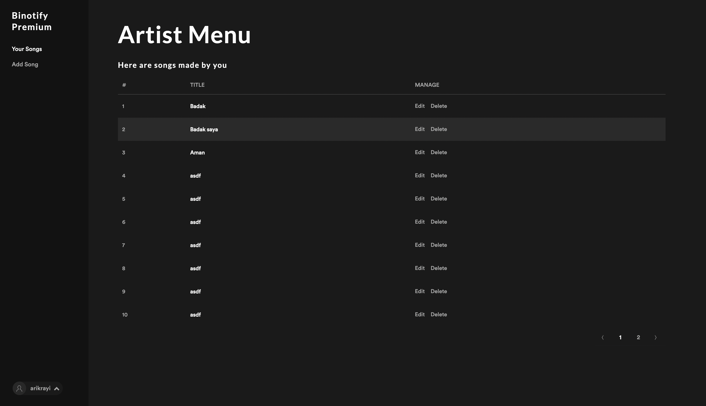
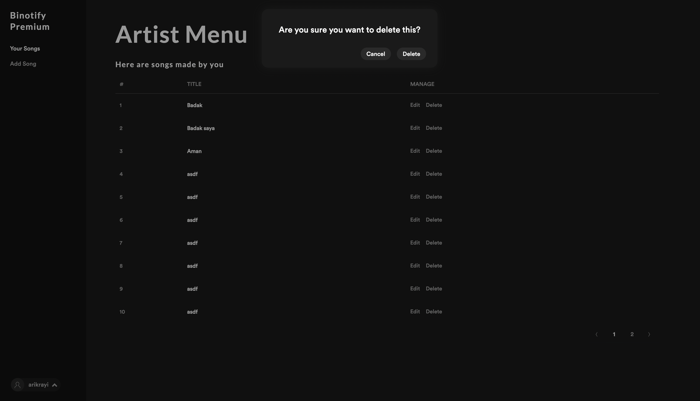

# Binotify Premium

Binotify premium is a new portal for Binotify's premium artist to add, edit, or delete their songs. Our admin can also accept or reject Binotify users subscription request for Binotify's premium artist here.

Made with ? with

|              Name              |   NIM    |
| :----------------------------: | :------: |
| Muhammad Garebaldhie ER Rahman | 13520029 |
|        I Gede Arya R. P        | 13520036 |
|      Arik Rayi Arkananta       | 13520048 |

## Screenshot







## User Functionality

1. All user

   - Register for artist
   - Login

2. Artist

   - See premium songs by them
   - Edit premium songs by them
   - Delete premium songs by then
   - Logout

4. Admin
   - See all pending subscription requests
   - Accept pending subscription request
   - Reject pending subscription request

## Requirement list

1. Docker
2. Yarn
3. Node.js
4. Binotify REST Service running
5. Binotify SOAP Service running

## Installation

1. Install requirements

   - For windows and mac user

     - Download docker desktop [here](https://www.docker.com/products/docker-desktop/)

   - For UNIX like user run commands below

   ```sh
    sudo apt-get update
    sudo apt-get install docker-ce docker-ce-cli containerd.io docker-compose-plugin
   ```

   To verify if docker is already installed run with `docker run hello-world` and for UNIX users don't forget to add `sudo`

2. Clone this repository
3. By default this application use port `10000` and if your computer already use the port please change it in `docker-compose.yml` file and you can refer to guide in [here](https://docs.docker.com/compose/gettingstarted/)

## How to run

1. Change directory to the clonned repo
2. Create `.env` file by using the example
3. Fill `VITE_MODE` and `VITE_REST_API_URL` in your `.env` file
   1. You can fill it with anything you would like for example
   ```env
   VITE_MODE=production
   VITE_REST_API_URL=http://localhost:{REST API port}
   ```
4. Run `docker compose up -d`

## How are the tasks divided?

| Muhammad Garebaldhie ER Rahman |    I Gede Arya R. P    | Arik Rayi Arkananta        |
| ------------------------------ | :--------------------: | -------------------------- |
| API integration for accept subscription list|API integration for reject subscription list|Login UI & API integration|
| Docker setup                  | Refactor hard code | Register UI & API integration|
|                               |                     | Artist song list UI & API integration|
|                               |                     | Edit song UI & API integration|
|                               |                     | Add song UI & API integration|
|                               |                     | Delete song UI & API integration|
|                               |                     | Subscription request list UI & API integraion|
|                               |                     | Accept & Reject subscription requst list UI|
|                               |                     | Sidebar UI & integration|
